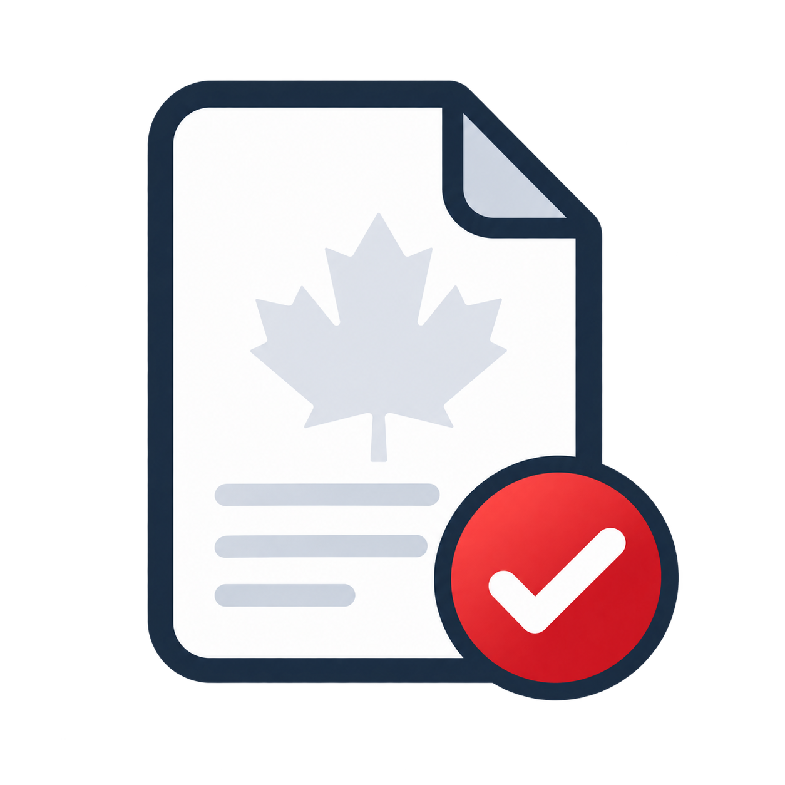

<p align="center">
  
</p>

<h1 align="center">TaxAgent Canada</h1>

<p align="center">
  Local-first PDF intake and return-preparation workspace for a bounded Quebec salary/student profile.
</p>

<p align="center">
  <a href="#quick-start">Quick start</a> |
  <a href="#current-scope">Current scope</a> |
  <a href="#workflow">Workflow</a> |
  <a href="#privacy">Privacy</a> |
  <a href="docs/user/guide.md">User guide</a>
</p>

<p align="center">
  
  
  
</p>

TaxAgent Canada helps you:

- Import local tax-slip PDFs into a 2020-2025 year workspace.
- Review unresolved PDF candidates, duplicates, amendments, and missing facts.
- Calculate covered federal and Quebec return lines for ready active years.
- Save input JSON, result JSON, and a text review packet for your own records.

It does not file a return, connect to CRA or Revenu Quebec accounts, request government credentials, or create NETFILE, ReFILE, or NetFile Quebec submission files.

## Quick Start

Clone the main branch and install the local web extra.

<details open>
<summary>Windows PowerShell</summary>

```powershell
git clone https://github.com/K-kiron/TaxAgent.git
cd TaxAgent
py -3.11 -m venv .venv
.\.venv\Scripts\python.exe -m pip install --upgrade pip
.\.venv\Scripts\python.exe -m pip install ".[web]"
.\.venv\Scripts\taxagent.exe doctor
.\.venv\Scripts\taxagent.exe start
```

Open the [local TaxAgent app](http://127.0.0.1:8056).

</details>

<details>
<summary>Linux or macOS</summary>

```bash
git clone https://github.com/K-kiron/TaxAgent.git
cd TaxAgent
python3.11 -m venv .venv
. .venv/bin/activate
python -m pip install --upgrade pip
python -m pip install ".[web]"
taxagent doctor
taxagent start
```

Open the [local TaxAgent app](http://127.0.0.1:8056).

</details>

## Current Scope

| Area | Current support |
| --- | --- |
| Years | Batch workspace for 2020 through 2025 |
| Jurisdiction | Federal Canada + Quebec |
| Supported persona | Full-year Canadian and Quebec resident, Quebec province on December 31, single, no dependants, ordinary salary/student situation |
| PDF intake | Local digital-text PDFs, AcroForm fields, and bounded local OCR |
| Imported slips | T4, RL-1, T4A, T4E, T5, RL-3, T2202, RL-8 tuition evidence, RRSP receipts, RC210, and RL-19 within implemented boxes |
| Filing | Preparation and export only |

Unsupported or unknown facts block calculation instead of being estimated. The detailed operating guide, limits, collection links, and filing handoff notes are in the [TaxAgent user guide](docs/user/guide.md).

## Workflow

1. Collect PDFs and account facts from your issuers, CRA records, and Revenu Quebec records.
2. Start the local browser app and drop your PDF slips or restore a saved TaxAgent JSON workspace.
3. Check the year summary and resolve only candidates or facts that the app flags for review.
4. Choose the active years that need a return. For a year with no income slips, create an explicit no-slip year.
5. Confirm the supported profile and answer the facts that still block the selected year.
6. Select Calculate ready years. The app processes active consecutive years in order and reports any blockers.
7. Save the input JSON, result JSON, or text review packet you want to keep.

## Privacy

The preparation app runs on loopback and performs PDF/OCR work locally. The deterministic return calculation does not call a language model, CRA, Revenu Quebec, or tax software accounts.

The browser keeps active data in memory by default. Reset clears the current in-memory workspace, selected PDFs, review choices, and results. Saved JSON and review packets are plaintext files on your computer.

## Release PDF Fixtures

Ordinary CI uses project-authored synthetic PDF fixtures. Generate and verify them with:

```bash
python scripts/release/provision_synthetic_pdf_fixtures.py
```

The installed-wheel acceptance script is intended for a clean virtual environment after installing the built wheel. It rejects imports from the source checkout:

```bash
python tests/release/installed_pdf_acceptance.py --repo-root . --fixtures tests/fixtures/pdf/synthetic --scan-fixture tests/fixtures/pdf/t4_scan_2025.pdf
```

These synthetic fixtures cover digital text, AcroForm widgets, OCR, packaging, and the six-year batch return workflow. They are not government forms and do not prove official-layout compatibility.

Official PDF compatibility is a separate local opt-in check for testers who already have the government PDF originals. The originals are not bundled in this repository and CI does not download them. Place tester-provided originals under `tests/fixtures/pdf/official/official` or pass a source corpus, then run:

```bash
python scripts/release/provision_official_pdf_fixtures.py --offline
python tests/release/local_official_pdf_acceptance.py
```

## License

Apache License 2.0. See [LICENSE](LICENSE).

TaxAgent Canada is not certified tax software and does not provide certified tax, legal, accounting, or financial advice. Verify important decisions against official sources or a qualified professional before filing.
